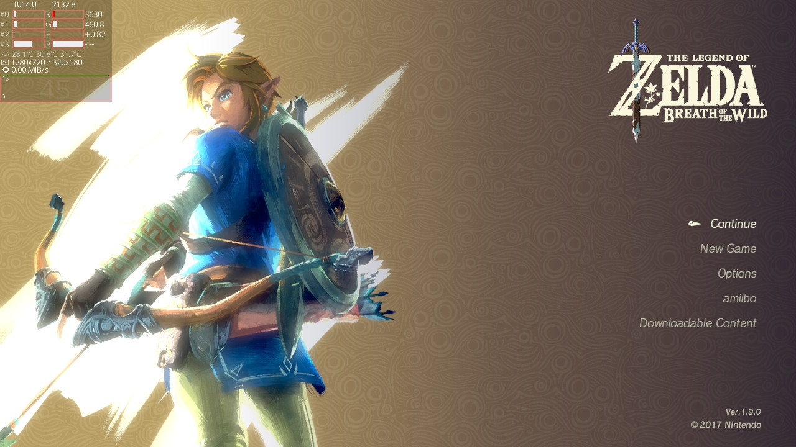

# SMD-Files
Repository for storing additional SMD files for Status Monitor Deux

.smd file must be put to `sdmc:/config/status-monitor-deux/modes/`

# Compact

  
Preview

Requires sys-clk or hoc-clk for now to work properly 
[Download](https://github.com/masagrator/SMD-Files/blob/comp/Compact/Compact.smd)
